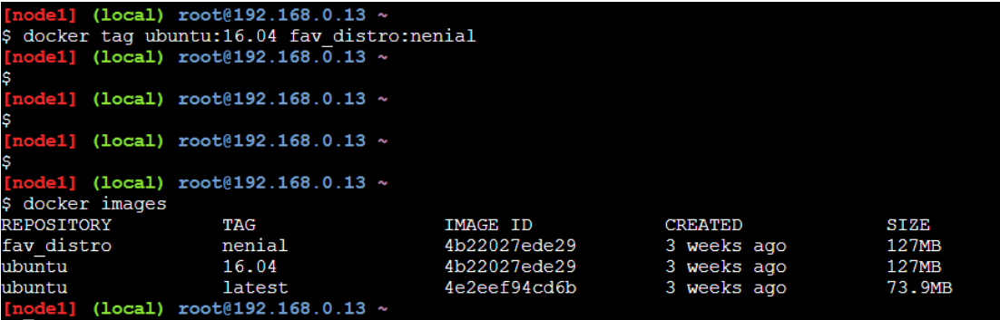
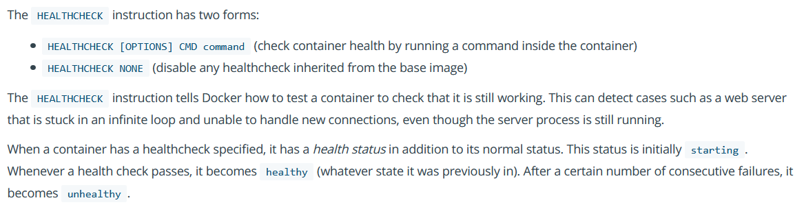
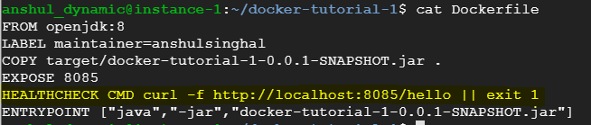
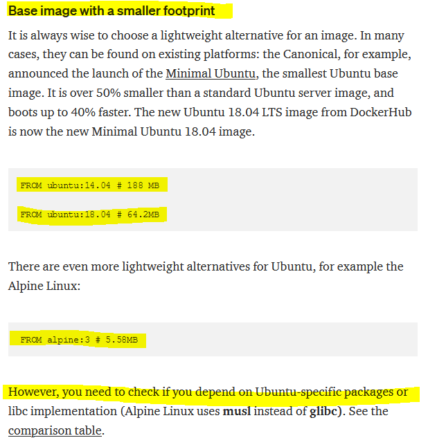
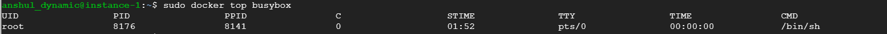
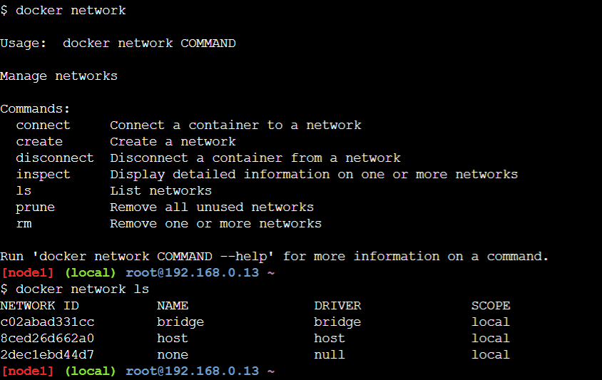
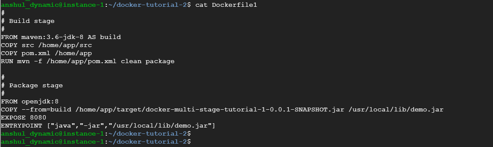

# Docker-FAQs

#####  References
https://www.oreilly.com/content/docker-networking-service-discovery/

https://dockerlabs.collabnix.com/networking/A2-bridge-networking.html

https://www.metricfire.com/blog/understanding-docker-networking-part-ii/

https://www.youtube.com/watch?v=MGBAXJnoqbA

https://monkelite.com/introduction-to-docker-networking/

#####  What will happen if we remove the docker image but the container exists for the same image. Container’ status is stopped though.

It will fail saying as follows:


#####  What is the command to remove docker image

docker rmi \<image-name\>

#####  What is the command to list all docker containers

docker ps -a

#####  What is the command to list running containers

docker ps

#####  What is the command to remove docker container

docker rm \<container-id\>

#####  What is the command to remove all stopped docker containers in one go

`docker container prune` is the command to remove all stopped containers. Command will not affect running containers.

#####  What is the command to clear all dangling images and stopped container in one go

docker system prune


#####  What is the difference between `docker run hello-world` vs `docker pull hello-world`

`docker pull` will just download the image and do not run it.

#####  What is the command to view list of docker images

docker images

#####  What will happen if we remove running docker container using docker rm command

Command will fail saying that first stop the container and then remove it.

#####  What is the command to run the docker container in background?

docker run -d \<image-name\>

#####  What is the command to stop running docker container

docker stop \<container-id\>

#####  Which version of docker image will be downloaded if not mentioned explicitly

latest will be pulled (marked with latest tag in docker hub)

#####  How to pull a specific version of docker image, say ubuntu?

docker pull ubuntu:16.04


##### What is the command to rename a docker image

It can be done using tagging as follows:



##### What is the naming convention for Docker file name

Dockerfile

##### How to write commands in Dockerfile


    
##### What is the difference between ENTRYPOINT and CMD instruction in Dockerfile

Docker has a default entry point which is `/bin/sh -c` but does not have a default command.
When you run docker like this: 
```
docker run -it ubuntu bash
``` 
The entry point is the default `/bin/sh -c`, the image is `ubuntu` and the command is `bash`.
The command is run via the entry point. i.e., the actual thing that gets executed is `/bin/sh -c bash`.
Everything after `ubuntu` in the example above is the command and is passed to the entry point.

The `CMD` specifies arguments that will be fed to the `ENTRYPOINT`.

For example, if your Dockerfile is:
```
FROM debian:wheezy
ENTRYPOINT ["/bin/ping"]
CMD ["localhost"]
```

Running the image without any argument will ping the localhost:

```
$ docker run -it test
PING localhost (127.0.0.1): 48 data bytes
56 bytes from 127.0.0.1: icmp_seq=0 ttl=64 time=0.096 ms
56 bytes from 127.0.0.1: icmp_seq=1 ttl=64 time=0.088 ms
56 bytes from 127.0.0.1: icmp_seq=2 ttl=64 time=0.088 ms
^C--- localhost ping statistics ---
3 packets transmitted, 3 packets received, 0% packet loss
round-trip min/avg/max/stddev = 0.088/0.091/0.096/0.000 ms
```

Now, running the image with an argument will ping the argument:

```
$ docker run -it test google.com
PING google.com (173.194.45.70): 48 data bytes
56 bytes from 173.194.45.70: icmp_seq=0 ttl=55 time=32.583 ms
56 bytes from 173.194.45.70: icmp_seq=2 ttl=55 time=30.327 ms
56 bytes from 173.194.45.70: icmp_seq=4 ttl=55 time=46.379 ms
^C--- google.com ping statistics ---
5 packets transmitted, 3 packets received, 40% packet loss
round-trip min/avg/max/stddev = 30.327/36.430/46.379/7.095 ms
```

##### What is the command to get low level details of docker container in json format

docker inspect \<container-id\>

docker inspect \<container-name\>

For example -

$ docker inspect 81eb9b5dfdbc
```
[
    {
        "Id": "81eb9b5dfdbc965ee0469ecd0eb490cb71d88127c9ef58fbfb77095c4d96d77b",
        "Created": "2020-09-12T09:41:20.157319348Z",
        "Path": "/usr/local/bin/youtube-dl",
        "Args": [
            "https://imgur.com/JY5tHqr"
        ],
        "State": {
            "Status": "exited",
            "Running": false,
            "Paused": false,
            "Restarting": false,
            "OOMKilled": false,
            "Dead": false,
            "Pid": 0,
            "ExitCode": 0,
            "Error": "",
            "StartedAt": "2020-09-12T09:41:20.679991253Z",
            "FinishedAt": "2020-09-12T09:41:22.005890139Z"
        },
        "Image": "sha256:ea66b0b151c5bd3a2e03de469fcfbf62f301c29778b96c7382cea9555ccd6897",
        "ResolvConfPath": "/var/lib/docker/containers/81eb9b5dfdbc965ee0469ecd0eb490cb71d88127c9ef58fbfb77095c4d96d77b/resolv.conf",
        "HostnamePath": "/var/lib/docker/containers/81eb9b5dfdbc965ee0469ecd0eb490cb71d88127c9ef58fbfb77095c4d96d77b/hostname",
        "HostsPath": "/var/lib/docker/containers/81eb9b5dfdbc965ee0469ecd0eb490cb71d88127c9ef58fbfb77095c4d96d77b/hosts",
        "LogPath": "/var/lib/docker/containers/81eb9b5dfdbc965ee0469ecd0eb490cb71d88127c9ef58fbfb77095c4d96d77b/81eb9b5dfdbc965ee0469ecd0eb490cb71d88127c9ef58fbfb77095c4d96d77b-json.log",
        "Name": "/nostalgic_mahavira",
        "RestartCount": 0,
        "Driver": "overlay2",
        "Platform": "linux",
        "MountLabel": "",
        "ProcessLabel": "",
        "AppArmorProfile": "docker-default",
        "ExecIDs": null,
        "HostConfig": {
            "Binds": [
                "/root/docker-app-1:/mydir"
            ],
            "ContainerIDFile": "",
            "LogConfig": {
                "Type": "json-file",
                "Config": {}
            },
            "NetworkMode": "default",
            "PortBindings": {},
            "RestartPolicy": {
                "Name": "no",
                "MaximumRetryCount": 0
            },
            "AutoRemove": false,
            "VolumeDriver": "",
            "VolumesFrom": null,
            "CapAdd": null,
            "CapDrop": null,
            "Capabilities": null,
            "Dns": [],
            "DnsOptions": [],
            "DnsSearch": [],
            "ExtraHosts": null,
            "GroupAdd": null,
            "IpcMode": "private",
            "Cgroup": "",
            "Links": null,
            "OomScoreAdj": 0,
            "PidMode": "",
            "Privileged": false,
            "PublishAllPorts": false,
            "ReadonlyRootfs": false,
            "SecurityOpt": null,
            "UTSMode": "",
            "UsernsMode": "",
            "ShmSize": 67108864,
            "Runtime": "runc",
            "ConsoleSize": [
                0,
                0
            ],
            "Isolation": "",
            "CpuShares": 0,
            "Memory": 0,
            "NanoCpus": 0,
            "CgroupParent": "",
            "BlkioWeight": 0,
            "BlkioWeightDevice": [],
            "BlkioDeviceReadBps": null,
            "BlkioDeviceWriteBps": null,
            "BlkioDeviceReadIOps": null,
            "BlkioDeviceWriteIOps": null,
            "CpuPeriod": 0,
            "CpuQuota": 0,
            "CpuRealtimePeriod": 0,
            "CpuRealtimeRuntime": 0,
            "CpusetCpus": "",
            "CpusetMems": "",
            "Devices": [],
            "DeviceCgroupRules": null,
            "DeviceRequests": null,
            "KernelMemory": 0,
            "KernelMemoryTCP": 0,
            "MemoryReservation": 0,
            "MemorySwap": 0,
            "MemorySwappiness": null,
            "OomKillDisable": false,
            "PidsLimit": null,
            "Ulimits": null,
            "CpuCount": 0,
            "CpuPercent": 0,
            "IOMaximumIOps": 0,
            "IOMaximumBandwidth": 0,
            "MaskedPaths": [
                "/proc/asound",
                "/proc/acpi",
                "/proc/kcore",
                "/proc/keys",
                "/proc/latency_stats",
                "/proc/timer_list",
                "/proc/timer_stats",
                "/proc/sched_debug",
                "/proc/scsi",
                "/sys/firmware"
            ],
            "ReadonlyPaths": [
                "/proc/bus",
                "/proc/fs",
                "/proc/irq",
                "/proc/sys",
                "/proc/sysrq-trigger"
            ]
        },
        "GraphDriver": {
            "Data": {
                "LowerDir": "/var/lib/docker/overlay2/b03d45ecd073495f9fa8290f9f9e9799a9d3c3f886adcacd3178305a44b089f7-init/diff:/var/lib/docker/overlay2/6b3b1af1d21ce646c162121b83e2b56a02dae96dcdf71bd7b532401470503f83/diff:/var/lib/docker/overlay2/6de8cc588ca330c6f24c94be0c130bc7ae65a6aa90cdaf9acb23ddb946932431/diff:/var/lib/docker/overlay2/ff5649136bc3d6ac263e831187ce963e1971ae06d639b55e2acdc994e349aebe/diff:/var/lib/docker/overlay2/ef0d619f04d3b158c2fce5b4de4e49181c1f5d8c06fd317edefc931d62af2ab4/diff:/var/lib/docker/overlay2/da4a212010cb34b29dc27b4381e6b8bd3e8c05ff6a90cc3c52a48ee6f044f1b7/diff:/var/lib/docker/overlay2/ce9384ecda6ab6f71659b5dc5ccd13ba495065d0a7212c9cfe2a0ce285ef36de/diff:/var/lib/docker/overlay2/f17520ffc34c871663cfeb0d41e0fd8de0be2548f6aad1a962a242bd8813cdd9/diff",
                "MergedDir": "/var/lib/docker/overlay2/b03d45ecd073495f9fa8290f9f9e9799a9d3c3f886adcacd3178305a44b089f7/merged",
                "UpperDir": "/var/lib/docker/overlay2/b03d45ecd073495f9fa8290f9f9e9799a9d3c3f886adcacd3178305a44b089f7/diff",
                "WorkDir": "/var/lib/docker/overlay2/b03d45ecd073495f9fa8290f9f9e9799a9d3c3f886adcacd3178305a44b089f7/work"
            },
            "Name": "overlay2"
        },
        "Mounts": [
            {
                "Type": "bind",
                "Source": "/root/docker-app-1",
                "Destination": "/mydir",
                "Mode": "",
                "RW": true,
                "Propagation": "rprivate"
            }
        ],
        "Config": {
            "Hostname": "81eb9b5dfdbc",
            "Domainname": "",
            "User": "",
            "AttachStdin": false,
            "AttachStdout": true,
            "AttachStderr": true,
            "Tty": false,
            "OpenStdin": false,
            "StdinOnce": false,
            "Env": [
                "PATH=/usr/local/sbin:/usr/local/bin:/usr/sbin:/usr/bin:/sbin:/bin",
                "LC_ALL=C.UTF-8"
            ],
            "Cmd": [
                "https://imgur.com/JY5tHqr"
            ],
            "Image": "youtube-dl",
            "Volumes": null,
            "WorkingDir": "",
            "Entrypoint": [
                "/usr/local/bin/youtube-dl"
            ],
            "OnBuild": null,
            "Labels": {}
        },
        "NetworkSettings": {
            "Bridge": "",
            "SandboxID": "51e455c02b87680b4e10fc403b50d40a9a438b1176a70d28fc22017a851d1b8b",
            "HairpinMode": false,
            "LinkLocalIPv6Address": "",
            "LinkLocalIPv6PrefixLen": 0,
            "Ports": {},
            "SandboxKey": "/var/run/docker/netns/51e455c02b87",
            "SecondaryIPAddresses": null,
            "SecondaryIPv6Addresses": null,
            "EndpointID": "",
            "Gateway": "",
            "GlobalIPv6Address": "",
            "GlobalIPv6PrefixLen": 0,
            "IPAddress": "",
            "IPPrefixLen": 0,
            "IPv6Gateway": "",
            "MacAddress": "",
            "Networks": {
                "bridge": {
                    "IPAMConfig": null,
                    "Links": null,
                    "Aliases": null,
                    "NetworkID": "5bb2506e669a86daf4a16f5d8396866abac2e73b6c33ded0c77d4d972c9e4762",
                    "EndpointID": "",
                    "Gateway": "",
                    "IPAddress": "",
                    "IPPrefixLen": 0,
                    "IPv6Gateway": "",
                    "GlobalIPv6Address": "",
                    "GlobalIPv6PrefixLen": 0,
                    "MacAddress": "",
                    "DriverOpts": null
                }
            }
        }
    }
]
```

##### What is the command to get low level details of docker image in json format

docker inspect \<image-name\>

Same command can be used to inspect container or image.


##### How to execute multiple commands in one chain and what are the benefits of doing the same. Explain with example.

Refer link - https://stackoverflow.com/questions/33322103/multiple-froms-what-it-means


##### Given an example of creating simple Dockerfile (spring boot app with one rest end point)

Following are the steps to dockerize spring boot app - 

1. Create spring boot app using spring initializer (https://start.spring.io/)
2. Create REST URL using Spring web
3. Build above project and test if rest end is working correctly
4. Create a file named Dockerfile with content as follows:
5. Go to root of the spring boot project and build and run docker image via following command:

##### sudo docker build -t spring-boot-docker-app .

##### sudo docker run -p 8085:8085 spring-boot-docker-app


##### What is the difference between ADD and COPY? where to use which instruction?


##### Can we have multiple FROM instruction in single docker file?

Yes, it is possible. Docker offers a capability named multi-stage build.

For example:


##### Explain various commands which can be written in Dockerfile.

refer link - https://kapeli.com/cheat_sheets/Dockerfile.docset/Contents/Resources/Documents/index


##### Which one should be used LABEL or MAINTAINER command in Dockefile?


##### Be default which labels are inherited in docker image?

Labels from base image i.e. from FROM command

##### If we have a label defined in image defined multiple times for same key then which value will be picked?

Most recently value will be picked.

##### What exactly EXPOSE command does in Dockerfile?


##### Is it possible to find out what ports are exposed from the image without running it?


##### ARG or ENV, which one to use in this case?


##### what is the meaning of WORKDIR in Dockerfile?


1. You can think of WORKDIR like a cd inside the container (it affects commands that come later in the Dockerfile, like the RUN command).

2. Since your Dockerfile location on the host machine has nothing to do with the pwd inside the container. 
You can put the Dockerfile wherever you'd like in your project.

##### what is the concept of STOPSIGNAL command Dockerfile?


##### What is the concept of HEALTHCHECK command in Dockerfile? Explain with an example.

Refer link - https://docs.docker.com/engine/reference/builder/#user



Following screenshot displays REST endpoint which throws exception. Same URL is used in healthcheck.

 

 

 

 

 

##### Which is the command to inspect size of each layer in created docker image?

docker image history <image-name>


##### Which could be points to optimize docker images?

Refer link - https://medium.com/sciforce/strategies-of-docker-images-optimization-2ca9cc5719b6




Another useful link - https://stackoverflow.com/questions/45594707/what-is-pips-no-cache-dir-good-for


##### How to clean up selected images?


##### What could be the way to reduce docker build time?


##### How to mount data volume

Refer link - https://rominirani.com/docker-tutorial-series-part-7-data-volumes-93073a1b5b72

##### What the following command will do

`docker run -it -v /data --name container1 busybox`

1. It will launch busybox container with re-named as container1
2. Inside the container at the root directory, it will create a data folder.
3. Inside data folder, create a blank file
4. Exit the container
5. Inspect the container and see mount details 
6. You will notice that container data volume is mapped to the host machine folder listed in docker inspect command output. So any file will be persisted this way.

##### What happens if you launch another container with the same `/data` volume. Is the file still there or does each container get its own file system?

File will not be there as follows:


It will create different folder in docker:

```
/var/lib/docker/volumes/c8cac6aeff11ddea0cc3e3e2ad352f63adfaf101232fd2140c3023357a587a8c/_data

/var/lib/docker/volumes/38d2c689518872c141488ba3f5bc803af86e695186b6d497ef2ac9ef5c568602/_data
```

##### How to map host folder to container folder so that data can be reflected back:

To mount a host volume while launching a Docker container, we have to use the following format for volume -v :
`-v HostFolder:ContainerVolumeName`


##### What is the command to remove all unused containers, volumes, networks and images

docker system prune -a --volumes

##### How to share volume among multiple containers


##### What is the command to check all docker volumes


##### How to expose and publish a port
Opening a connection from outside world to a docker container happens in two steps:

1. Exposing port
2. Publishing port

Exposing a container port means that you tell Docker that the container listens to a certain port.
Publishing a port means that Docker will map containers ports to host (your machine) ports.
To expose a port, add line EXPOSE <port> in your Dockerfile
To publish a port, run the container with -p <host-port>:<container-port>


##### What is the command to get host port to which container port is mapped in case host port is not explicitly provided

docker port \<container id\>

##### What is the purpose of docker compose

docker-compose is designed to simplify running multi-container applications to using a single command.

##### Is there any command to search for an image

docker search <image-name> but this search will be made in docker hub registry.

For example - docker search hello-world


##### How to check docker container logs

To check docker logs just use the following command:
`docker logs --help`

Usage:  docker logs [OPTIONS] CONTAINER

Fetch the logs of a container

Options:
      --details        Show extra details provided to logs
  -f, --follow         Follow log output
      --help           Print usage
      --since string   Show logs since timestamp
      --tail string    Number of lines to show from the end of the logs (default "all")
  -t, --timestamps     Show timestamps

Some example:
docker logs --since=1h \<container_id\>

##### What is the benefit of using docker attach command?

When containers are run with the interactive option, you can connect to the container and enter commands as if you are on the terminal:

```
$ docker run -itd --name busybox busybox
dcaecf3335f9142e8c70a2ae05a386395b49d610be345b3a12d2961fccab1478

$ docker attach busybox
/ # echo hello world
hello world
```

The attach option also allows multiple connections to view the same container and see what each is typing.

Docker attach command is used to attach our terminal to a running container to control I/O operations.

**Please perform following steps to better understand attach command:**
- **sudo docker run -itd --name busybox busybox /bin/sh** => this command will spawn a container in background and return container id. Container will keep running.
- **sudo docker top busybox** => this command will print process and parent process id for this container
- **sudo docker attach busybox** => this command will create a pipeline between current terminal and container for standard input/output/error. whatever we will type now in current terminal, it is like typing inside container. similarly, if there is logs getting printed inside container then those will be streamed to current terminal. After attaching to container, if you run any command then it might create new process.
- **type CTRL-P and CTRL-Q** => you will come out of container although container will still be running.





**Another benefit is like starting spring boot web application** in a container and then attach to running container immediately. As soon as attacment is successful then all console logs will be streamed to current terminal.

##### Why to run containers in interactive mode?

Docker allows you to run a container in interactive mode. This means you can execute commands inside the container while it is still running.

**Always use -it option if you want to run docker containers in interactive mode.**

##### What is the benefit of using docker exec command?

**Please perform following steps to better understand attach command:**
- **sudo docker run -itd --name busybox busybox /bin/sh** => this command will spawn a container in background and return container id. Container will keep running.
- **sudo docker top busybox** => this command will print process and parent process id for this container
- **sudo docker exec -it busybox /bin/sh** => this command will create new process inside container environment without disturbing existing running process inside container.


**Overall**

- If want to try something new inside container environment without disturbing running container then **exec** command can be used.
- If want to check what is going on inside running container then **attach** command is more useful.

##### What is the command to check running processes inside container environment?

sudo docker top \<container-name\>

##### Give some examples of docker-compose

https://springframework.guru/manage-docker-containers-with-docker-compose/

https://towardsdatascience.com/docker-compose-44a8112c850a

##### Which file is used to write docker compose configuration

Docker-compose.yml

##### Can we use custom file name instead of docker-compose.yml

Yes 

##### Which 3 are main tags used in docker-compose file


##### What is the syntax of writing services configuration:


##### What do we mean by volumes and networks?


##### Give a good example of using docker-compose yml file

https://raw.githubusercontent.com/spring-cloud/spring-cloud-dataflow/v2.6.1/spring-cloud-dataflow-server/docker-compose.yml


##### What is the difference between docker-compose up and docker-compose start?


##### Can I use json instead of yaml for my Compose file?


##### What is the difference between docker-compose stop and docker-compose down?


##### Explain docker network?


The relationship between a host and containers is 1:N. This means that one host typically has several containers running on it. For example, Facebook reports thatdepending on how beefy the machine isit sees on average some 10 to 40 containers per host running. And heres another data point: at Mesosphere, we found in various load tests on bare metal that not more than around 250 containers per host would be possible.

No matter if you have a single-host deployment or use a cluster of machines, you will almost always have to deal with networking:

For most single-host deployments, the question boils down to data exchange via a shared volume versus data exchange through networking (HTTP-based or otherwise). Although a Docker data volume is simple to use, it also introduces tight coupling, meaning that it will be harder to turn a single-host deployment into a multihost deployment. Naturally, the upside of shared volumes is speed.

In multi host deployments, you need to consider two aspects: how are containers communicating within a host and how does the communication paths look between different hosts. Both performance considerations and security aspects will likely influence your design decisions. Multihost deployments usually become necessary either when the capacity of a single host is insufficient (see the earlier discussion on average and maximal number of containers on a host) or when one wants to employ distributed systems such as Apache Spark, HDFS, or Cassandra.

In a nutshell, there are four modes available for Docker networking: 

bridge mode

host mode

none mode

#####  What is the command to check existing docker networks?

`docker network` command will display all the options.



#####  which is the default docker network for containers?

bridge network


You can inspect bridge network by executing following command:


When we launch any docker container without explicitly mentioning any network then container is assigned `bridge` network as follows:


You can also inspect docker conatiner and check its network settings as follows:


1. Container assigned to bridge network contains two network interfaces. A loopback interface and a private network interface.
2. The loopback interface is the same as one of the closed containers of 127.0.0.1 and it is used for internal applications and can’t be connected to the outside world.
3. The private network interface is connected to the bridge network.
4. Containers within same bridge network can connect to each other via loopback interface.
5. Containers can connect to outside world via private network interface.  
6. Containers from different bridge networks can’t connect with each other by default. But we can manually connect a container to another bridge network.
7. A bridge network is most suitable where you want to set up a relatively small network on a single host.

#####  what happens when any docker container is assigned to `none` network?


#####  Explain `none` network in detail?

Actually, the none network adds a container to a container-specific network stack. 
That container lacks a network interface, so it is totally isolated. 
This kind of container is called a closed container.


Google public DNS IP which is 8.8.8.8. If we ping this IP from our host machine, as you see, there is no problem to reach Google public DNS.
If we ping this IP from the closed container, the IP is unreachable. This container is isolated from the outside world.

#####  what is the benefit of using container with none network?

1. It provides the maximum level of network protection because the containers can not be reached from outside the host.
2. However, this network model won’t be a good choice if the network or Internet connection is required. For example, if the application requires making HTTP requests to the outside world.
3. This isolated network suites well where the container requires the maximum level of network security and network access is not necessary.  

#####  which are the most widely used maven plugin to create docker images currently?

Please refer: https://medium.com/@marcus_j/maven-plugins-for-docker-7bc34dfe0f0

- fabric8’s docker-maven-plugin


- Spotify’s docker-maven-plugin


- Spotify’s dockerfile-maven


#####  How to cache maven dependencies while building docker image?

- Problem with following docker file is that every time image is built, maven dependencies will be downloaded. Even if there is no change in pom.xml file then also all dependencies will be downloaded.



- following is one of ways by which this problem can be rectified. Here, only pom.xml is first copied in build context and then maven offline dependency goal will resolve all the dependencies.


